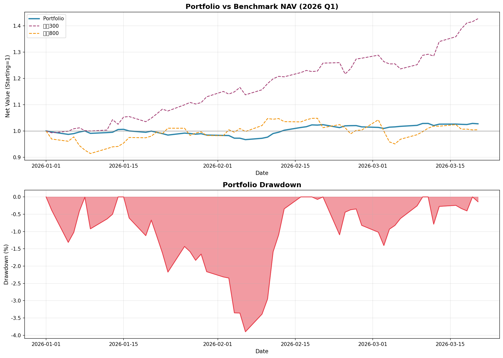

# ETF投资组合回测报告 - 2026年第一季度

**回测区间**: 2026年1月1日 - 2026年3月20日  
**交易日数**: 57天  
**报告生成时间**: 2026-03-21 17:26:37

## 一、组合表现概览

| 指标 | 组合 | 沪深300 | 中证800 |
|:---|:---:|:---:|:---:|
| 区间收益率 | 2.72% | 42.73% | 0.45% |
| 年化波动率 | 8.63% | 24.04% | 27.78% |
| 最大回撤 | -3.90% | -4.05% | -9.33% |
| 夏普比率 | 1.18 | 6.71 | 0.14 |
| 卡玛比率 | 3.13 | 40.31 | 0.62 |

## 二、各ETF表现明细

| ETF名称 | 代码 | 权重 | 区间收益率 | 年化波动率 | 最大回撤 | 夏普比率 | 卡玛比率 | 收益贡献 |
|:---|:---|:---:|:---:|:---:|:---:|:---:|:---:|:---:|
| 黄金ETF | 518880 | 15% | -4.30% | 20.44% | -6.72% | -0.96 | -2.64 | -0.64% |
| 黄金股ETF | 159562 | 10% | 2.45% | 30.58% | -14.38% | 0.44 | 1.08 | 0.24% |
| 军工龙头ETF | 512710 | 8% | 7.23% | 36.05% | -15.47% | 0.99 | 2.44 | 0.58% |
| 通信设备ETF | 515880 | 12% | -18.13% | 42.55% | -20.44% | -1.95 | -3.96 | -2.18% |
| 半导体ETF | 512480 | 5% | 25.05% | 48.35% | -15.02% | 2.28 | 7.47 | 1.25% |
| 人工智能ETF | 159819 | 3% | 24.88% | 53.49% | -20.32% | 2.10 | 5.62 | 0.75% |
| 电网设备ETF | 159326 | 10% | 20.57% | 28.03% | -8.95% | 3.07 | 9.85 | 2.06% |
| 电力ETF | 159611 | 5% | -11.30% | 22.22% | -16.93% | -2.41 | -3.04 | -0.56% |
| 恒生科技ETF | 513130 | 5% | 22.10% | 36.33% | -16.68% | 2.60 | 5.78 | 1.10% |
| 港股创新药ETF | 513120 | 2% | -3.92% | 39.26% | -17.60% | -0.32 | -0.59 | -0.08% |
| 货币基金 | CASH | 25% | 0.31% | 0.00% | 0.00% | 0.00 | 0.00 | 0.08% |

## 三、收益贡献分析

### 正向贡献

- **电网设备ETF**: 贡献收益 +2.06%
- **半导体ETF**: 贡献收益 +1.25%
- **恒生科技ETF**: 贡献收益 +1.10%
- **人工智能ETF**: 贡献收益 +0.75%
- **军工龙头ETF**: 贡献收益 +0.58%
- **黄金股ETF**: 贡献收益 +0.24%
- **货币基金**: 贡献收益 +0.08%

### 负向贡献

- **港股创新药ETF**: 贡献收益 -0.08%
- **电力ETF**: 贡献收益 -0.56%
- **黄金ETF**: 贡献收益 -0.64%
- **通信设备ETF**: 贡献收益 -2.18%

## 四、关键结论

1. **绝对收益**: 组合在回测期内实现收益 **2.72%**
2. **相对表现**: 相对于沪深300 -40.02%，相对于中证800 +2.27%
3. **风险水平**: 年化波动率 8.63%，最大回撤 -3.90%
4. **风险调整收益**: 夏普比率 1.18，卡玛比率 3.13
5. **最大贡献**: 电网设备ETF 贡献收益 +2.06%

## 五、图表

---

*注：货币基金按年化2%收益率计算，每日收益=2%/365*